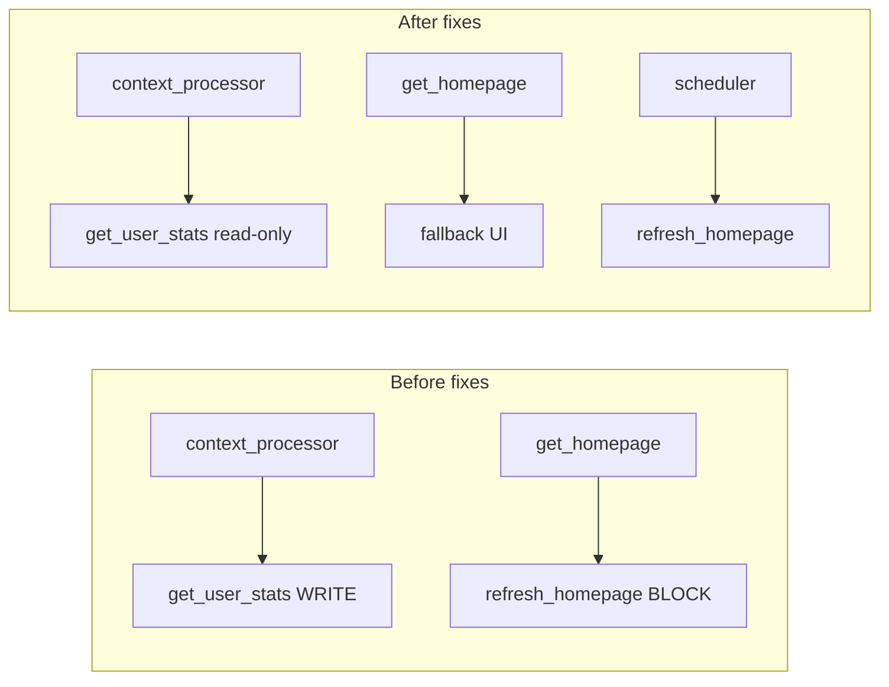

# Full-App Review — Estudio Abroad

Consolidated audit from **code-reviewer**, **performance-engineer**, and **QA** lenses (post user-auth). Cross-references [self-review.md](self-review.md) for Part 2 fixes; this document covers the full stack after per-user profiles shipped.

---

## Executive summary

| Lens | P0 | P1 | P2 | Fixed this audit | Deferred |
|------|---:|---:|---:|-----------------:|---------:|
| Correctness | 3 | 4 | 2 | 7 | 2 |
| Security | 2 | 2 | 2 | 3 | 3 |
| Performance | 2 | 1 | 1 | 5 | 1 |
| QA / maintainability | — | — | 3 | 1 (pytest suite) | 2 |
| **Total** | **7** | **7** | **8** | **16** | **8** |

**Bottom line:** The app was functionally solid for a demo but had correctness holes (vocab bypass, legacy migration, `xp_today`), a hot-path performance problem (stats write on every page view), and no automated tests. Phase 1–3 of this audit address those; infrastructure items (Postgres, file locking, rate limiting) remain documented for production.

---

## Critical path (authenticated requests)

Every logged-in HTML request runs the context processor in `app.py`:

```
inject_globals → get_last_refresh_display (read cache.json)
              → get_user_stats (read user + read cache)
              → current_user nav (read user once via flask.g memo)
```

Homepage adds `get_homepage()` (cache read + weak words). Before fixes, `get_user_stats` also **wrote** the user file on every view; cold cache triggered **synchronous** `refresh_homepage()` (3+ external APIs) in the request thread.



---

## Findings table

### P0 — Fixed

| Issue | Lens | Location | Resolution |
|-------|------|----------|------------|
| Legacy migration steals global data | Correctness | `user_store._migrate_legacy_user_data` | Migrate only when user index is empty **and** global cache has legacy keys |
| Session fixation | Security | `app.py` login/register | `session.clear()` + new CSRF via `_establish_session()` |
| Vocab index bypass (`?i=last`) | Correctness | `fetcher.get_vocab_session`, `record_flashcard_result` | Track `expected_index` + `visited_indices`; enforce sequential completion |
| Stats write on every read | Performance | `fetcher.get_user_stats` | Read-only derived stats; save only when defaults backfilled |
| Blocking refresh on cache miss | Performance | `fetcher.get_homepage` | Return fallback immediately; scheduler owns refresh |

### P1 — Fixed

| Issue | Lens | Location | Resolution |
|-------|------|----------|------------|
| `xp_today` never resets | Correctness | `fetcher.update_streak` | Reset `xp_today = 0` when calendar day changes |
| GET `/vocab?restart=1` mutates state | Best practice | `app.py`, `vocab.html` | `POST /vocab/restart` with CSRF |
| Registration index/user inconsistency | Correctness | `user_store.register_user` | Delete user file if index save fails |
| `add_phrase` length not enforced in fetcher | Security | `fetcher.add_phrase` | Mirror `PHRASE_MAX_LENGTH` cap |
| Duplicate `load_user` for avatar nav | Performance | `app._current_user_context` | Use `get_user_nav_info()` from memoized user cache |
| Record after session complete | Correctness | `record_flashcard_result` | Reject when `session.complete` |

### P1 — Deferred

| Issue | Lens | Notes |
|-------|------|-------|
| JSON RMW races (cache + user files) | Correctness / Perf | Needs file locking or DB; see README “What I'd Build Next” |
| No auth rate limiting | Security | Flask-Limiter deferred |
| `record_flashcard_result` races | Correctness | Same as RMW; low risk at demo scale |

### P2 — Addressed / deferred

| Issue | Lens | Status |
|-------|------|--------|
| No pytest suite | QA | **Fixed** — `tests/` + `requirements-dev.txt` |
| `fetcher.py` monolith (~1200 lines) | Readability | Deferred — split later |
| Flask blueprints / app factory-only | Best practice | Deferred |
| Session cookie flags (`Secure`, `SameSite`) | Security | Document for production config |
| Dictionary API URL encoding | Security | **Fixed** — `urllib.parse.quote` |
| A11y (reader fog, history tabs) | UX | Deferred from self-review |
| Render ephemeral disk | Infra | Documented in README |

---

## Code-reviewer dimensions (sample)

| Dimension | Notable findings |
|-----------|------------------|
| **Correctness** | Vocab bypass, migration gate, xp_today, index rollback |
| **Security** | Session regeneration, CSRF on vocab restart, phrase length in fetcher |
| **Performance** | Read-only stats, `flask.g` memoization, non-blocking homepage |
| **Reliability** | Atomic writes (prior self-review); RMW races still open |
| **Readability** | `fetcher.py` size; deferred split |
| **Best practices** | POST for state-changing vocab restart; GET remains read-only |

---

## What was fixed vs self-review

| Source | Fixed earlier (self-review) | Fixed in this audit |
|--------|----------------------------|---------------------|
| CSRF on phrasebook/vocab | ✓ | — |
| SECRET_KEY guard in prod | ✓ | — |
| Vocab deck validation (card match) | partial | Sequential session integrity |
| Atomic cache writes | ✓ | — |
| User profiles / per-user JSON | ✓ (feature) | Migration gate |
| — | — | Session regeneration, xp_today, read-only stats, pytest |

See [self-review.md](self-review.md) for the original 42 flags (10 fixed, 32 deferred).

---

## Measurement baseline and targets

| Metric | Before | Target (after) | Verified |
|--------|--------|----------------|----------|
| User file writes per authenticated `GET /` | 1+ | 0 (unless stats backfill) | Manual / code review |
| User file reads per request | 2–3 | 1 (memoized) | Code review |
| Cold cache homepage blocks on MyMemory | Yes | No | Code review |
| Vocab complete via `?i=last` | Yes | No | `test_should_not_complete_deck_when_index_skipped` |
| Second user inherits migrated data | Possible | No | Migration gate + unit logic |

Optional profiling: run `cProfile` on `GET /` (logged-in) and one `run_refresh()` tick; count `_load_cache` / `_save_user_cache` calls.

---

## Test coverage checklist

| Area | Test file | Cases |
|------|-----------|-------|
| Register / login | `test_auth.py` | Happy path, duplicate email, wrong password, CSRF |
| Phrasebook | `test_phrasebook.py` | Persist across logout, anonymous empty |
| Vocab | `test_vocab.py` | Auth required, card mismatch, no skip-to-complete |
| User store | `test_user_store.py` | Password hashing, invalid avatar bytes |

Run: `pip install -r requirements-dev.txt && pytest tests/ -v`

---

## Out of scope (document only)

- SQLite/Postgres migration (Render persistence)
- File locking / portalocker
- Flask-Limiter on auth routes
- Blueprint refactor of `app.py`
- E2E browser tests (Playwright)
- Parallel scheduler API calls

These remain in README “What I'd Build Next” and self-review deferred list.

---

## Verification checklist

- [x] `pytest tests/ -v` passes (11 tests)
- [x] Logged-in `GET /` does not write user stats on every view (read-only path)
- [x] Cold cache homepage returns without inline `refresh_homepage()`
- [x] Second registered user does not receive first user's migrated data (index gate)
- [x] Vocab cannot complete via skipped index / URL tampering

---

*Audit completed June 2026. Implementation commits: Fix (correctness/security), Perf (hot path), Test (pytest), Docs (this file).*
